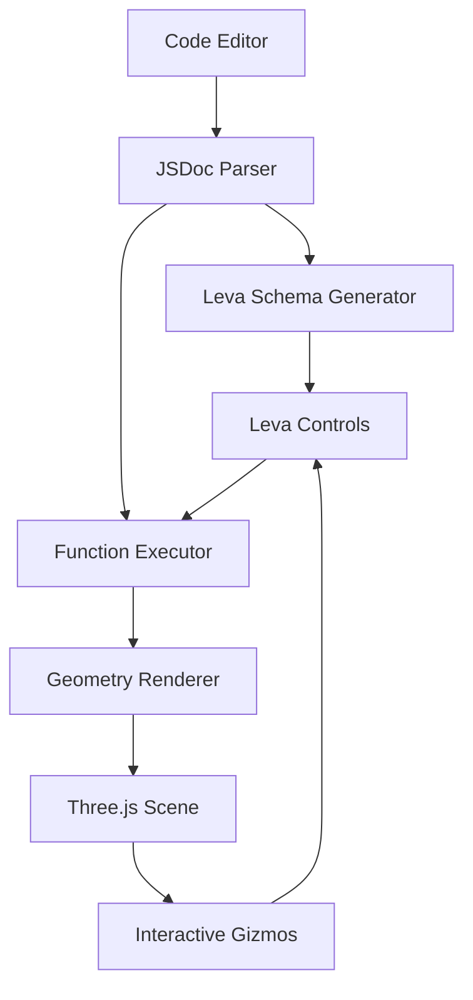
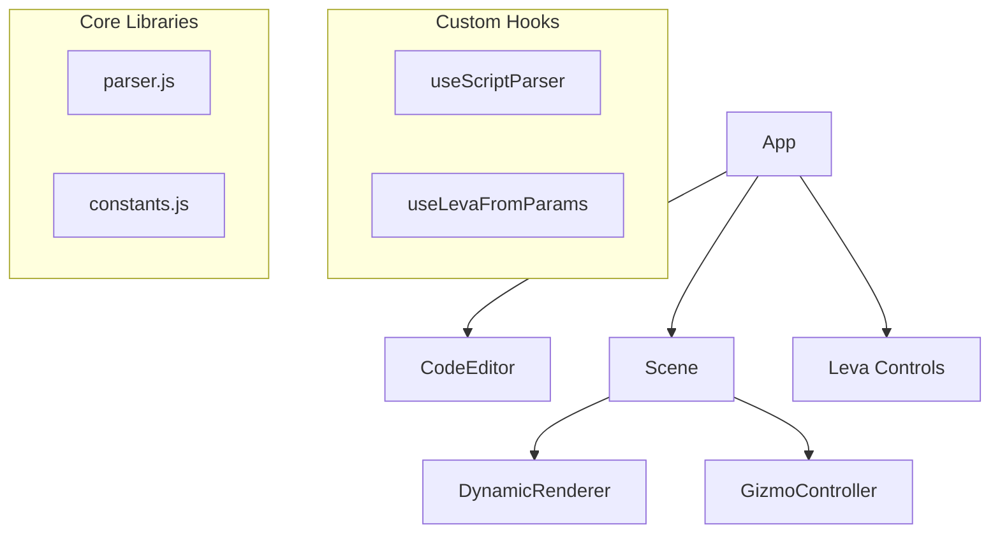

# Design Document

## Overview

The Grasshopper.js Sandbox is a React-based web application that transforms JSDoc-annotated JavaScript functions into interactive 3D geometry visualizations. The application follows a pipeline architecture where user code is parsed, UI controls are dynamically generated, and Three.js geometry is rendered with real-time parameter manipulation.

The core workflow involves: Code Input → JSDoc Parsing → UI Generation → Function Execution → 3D Rendering → Interactive Feedback Loop.

## Architecture

### High-Level Architecture



### Component Hierarchy



### Data Flow

1. **Input Phase**: User enters JSDoc-annotated JavaScript code
2. **Parsing Phase**: AST traversal extracts function metadata and body
3. **Schema Generation**: Parsed metadata creates Leva control schema
4. **Execution Phase**: Function runs with current parameter values
5. **Rendering Phase**: Returned geometry objects are styled and rendered
6. **Interaction Phase**: Gizmos and controls update parameters, triggering re-execution

## Components and Interfaces

### Core Components

#### App.jsx
**Purpose**: Main orchestrator component managing application state and coordination between subsystems.

**State Management**:
```javascript
const [code, setCode] = useState('');
const [executionError, setExecutionError] = useState(null);
```

**Key Responsibilities**:
- Coordinate between code editor, parser, and 3D scene
- Handle error states and user feedback
- Manage layout and responsive design

#### CodeEditor.jsx
**Purpose**: Code input interface with syntax highlighting and control buttons.

**Props Interface**:
```javascript
interface CodeEditorProps {
  code: string;
  onChange: (code: string) => void;
  onRun: () => void;
  onClear: () => void;
  onPasteFromClipboard: () => void;
  error?: string;
}
```

**Features**:
- Syntax highlighting using `react-simple-code-editor`
- Debounced auto-execution option
- Error display integration
- Clipboard API integration for paste functionality

#### Scene.jsx
**Purpose**: Three.js canvas container with camera controls and lighting setup.

**Props Interface**:
```javascript
interface SceneProps {
  parsedScript: ParsedScript;
  levaValues: Record<string, any>;
  outputVisibility: Record<string, boolean>;
}
```

**Scene Setup**:
- OrbitControls for camera manipulation
- Grid helper for spatial reference
- Ambient and directional lighting
- Responsive canvas sizing

#### DynamicRenderer.jsx
**Purpose**: Renders individual geometry objects with specified styling.

**Props Interface**:
```javascript
interface DynamicRendererProps {
  geometry: THREE.Object3D;
  style: 'filledThick' | 'wireframe' | 'transparentThick' | 'transparentThin';
  color: string;
  lineStyle?: 'solid' | 'dashed' | 'dotted';
  visible: boolean;
}
```

**Styling Logic**:
- Material selection based on style parameter
- Color application from predefined palette
- Edge geometry generation for outlined styles
- Line material configuration for wireframes

#### GizmoController.jsx
**Purpose**: Manages interactive 3D gizmos for direct parameter manipulation.

**Props Interface**:
```javascript
interface GizmoControllerProps {
  interactiveParams: InteractiveParam[];
  values: Record<string, any>;
  onChange: (paramName: string, value: any) => void;
}
```

**Gizmo Types**:
- Point gizmos for single 3D coordinates
- Multi-point gizmos for polyline manipulation
- Transform controls integration with Leva state

### Custom Hooks

#### useScriptParser.js
**Purpose**: Memoized JSDoc parsing with error handling.

**Interface**:
```javascript
function useScriptParser(code: string): {
  parsed: ParsedScript | null;
  error: string | null;
  isLoading: boolean;
}
```

**Parsing Pipeline**:
1. AST generation using Acorn
2. Function declaration extraction
3. JSDoc comment parsing
4. Metadata validation and structuring

#### useLevaFromParams.js
**Purpose**: Dynamic Leva schema generation and state management.

**Interface**:
```javascript
function useLevaFromParams(inputs: InputParam[], outputs: OutputParam[]): {
  schema: LevaSchema;
  values: Record<string, any>;
  outputVisibility: Record<string, boolean>;
}
```

**Schema Generation**:
- Input controls based on parameter types
- Folder organization from @folder tags
- Output visibility toggles
- Default value application

## Data Models

### ParsedScript Interface
```javascript
interface ParsedScript {
  inputs: InputParam[];
  outputs: OutputParam[];
  functionBody: string;
  argNames: string[];
  functionName: string;
}
```

### InputParam Interface
```javascript
interface InputParam {
  name: string;
  type: 'number' | 'string' | 'boolean' | 'number[]' | 'Array<number[]>' | 'THREE.BufferGeometry' | 'THREE.Mesh';
  folder?: string;
  description: string;
  metadata: {
    default?: any;
    min?: number;
    max?: number;
    step?: number;
    interactive?: boolean;
  };
}
```

### OutputParam Interface
```javascript
interface OutputParam {
  name: string;
  type: string;
  style: 'filledThick' | 'wireframe' | 'transparentThick' | 'transparentThin';
  color: 'Ocean' | 'Forest' | 'Sunset' | 'Grape' | 'Ruby' | 'Lemon' | 'Sky' | 'Blush';
  lineStyle?: 'solid' | 'dashed' | 'dotted';
}
```

### Color Palette Model
```javascript
interface ColorDefinition {
  name: string;
  base: string;
  light: string;
  dark: string;
}
```

## Error Handling

### Error Categories

1. **Parsing Errors**: Invalid JavaScript syntax or JSDoc format
2. **Execution Errors**: Runtime errors in user functions
3. **Rendering Errors**: Three.js geometry creation failures
4. **Validation Errors**: Invalid metadata or parameter specifications

### Error Handling Strategy

```javascript
// Centralized error boundary for React components
class ErrorBoundary extends React.Component {
  // Handle rendering errors gracefully
}

// Parser error handling
try {
  const ast = acorn.parse(code);
  // ... parsing logic
} catch (error) {
  return { error: `Syntax error: ${error.message}`, parsed: null };
}

// Execution error handling
try {
  const result = scriptFunction(...args);
  // ... result processing
} catch (error) {
  setExecutionError(`Runtime error: ${error.message}`);
}
```

### User Feedback

- Inline error messages in code editor
- Toast notifications for execution errors
- Fallback rendering for geometry errors
- Clear error descriptions with suggested fixes

## Testing Strategy

### Unit Testing

**Parser Testing**:
- JSDoc extraction accuracy
- Metadata parsing validation
- Error handling for malformed input
- AST traversal edge cases

**Component Testing**:
- Leva schema generation
- Geometry rendering with different styles
- Gizmo interaction behavior
- Error state handling

### Integration Testing

**End-to-End Workflows**:
- Complete code-to-render pipeline
- Interactive parameter manipulation
- Multi-object visibility management
- Error recovery scenarios

**Cross-Browser Testing**:
- WebGL compatibility
- Clipboard API availability
- Performance across devices
- Mobile responsiveness

### Performance Testing

**Optimization Targets**:
- Parser execution time < 100ms for typical functions
- Re-render time < 16ms for smooth 60fps interaction
- Memory usage monitoring for complex geometries
- Bundle size optimization for fast loading

### Test Data

**Sample Functions**:
- Simple geometric primitives (sphere, cube, cylinder)
- Complex parametric surfaces (lofted surfaces, NURBS)
- Multi-output functions with different styles
- Interactive polyline manipulation examples
- Error-inducing code samples for robustness testing

## Deployment Architecture

### Build Configuration

**Vite Configuration**:
- Static asset optimization
- Code splitting for lazy loading
- Environment variable management
- GitHub Pages deployment setup

**Dependencies**:
- Core: React, Three.js, @react-three/fiber, @react-three/drei
- UI: Leva for controls, react-simple-code-editor
- Parsing: Acorn for AST generation
- Build: Vite for bundling and development server

### GitHub Pages Deployment

**Build Process**:
1. `npm run build` generates optimized static files
2. Assets are bundled with proper base path configuration
3. Service worker for offline functionality (optional)
4. Automated deployment via GitHub Actions

**Performance Considerations**:
- CDN delivery for Three.js and React
- Gzip compression for text assets
- Lazy loading for non-critical components
- Progressive enhancement for advanced features